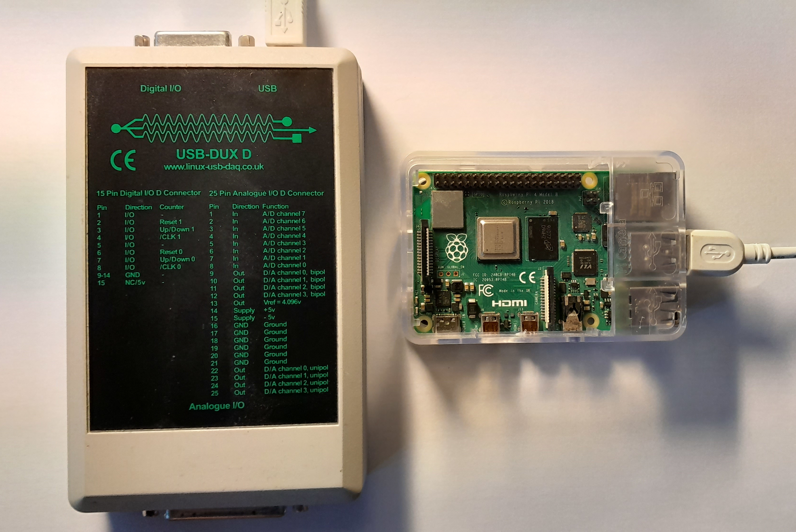

# COMEDI Raspberry pi USB bullseye kernel drivers

Raspberry PI has removed the COMEDI framework from the standard kernel.
In order to use COMEDI devices you need to compile and install comedi.

Only the drivers for COMEDI USB devices are compiled in particular [USB-DUX](https://github.com/glasgowneuro/usbdux):



## Compile

```
sudo apt install raspberrypi-kernel
make -C /usr/src/linux-headers-5.15.84-v8+/ M=$PWD
```
The above kernel header directory in `/usr/src` might differ depending if it's 64bit or 32bit.
Please check with `ls -l /usr/src`.

## Install

```
sudo make -C /usr/src/linux-headers-5.15.84-v8+/ M=$PWD modules_install
sudo depmod -a
sudo apt install firmware-linux-free
```

Edit `/etc/group` and add yourself to the group `iocard`.

Check with

```
sudo dmesg
```

if you see:

```
[ 3506.038554] comedi: version 0.7.76 - http://www.comedi.org
[ 3506.065482] comedi comedi0: ADC_zero = 80011c
[ 3506.066796] comedi comedi0: driver 'usbduxsigma' has successfully auto-configured 'usbduxsigma'.
[ 3506.066849] usbcore: registered new interface driver usbduxsigma
```

If you get an error message then the firmware is most likely not installed. Make
sure you install it with:
```
sudo apt install firmware-linux-free
```
